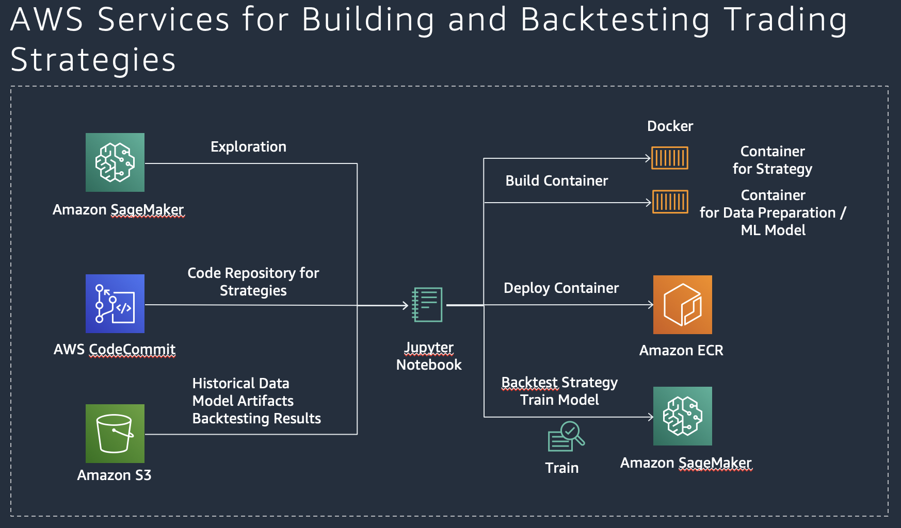
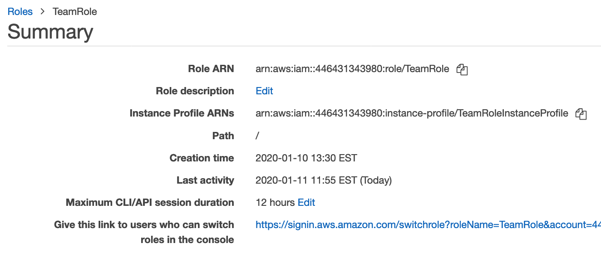
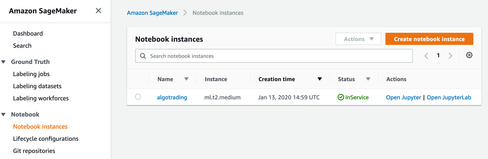
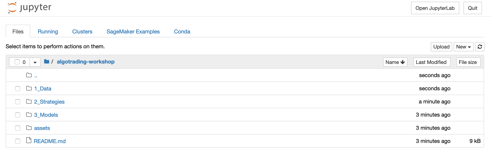
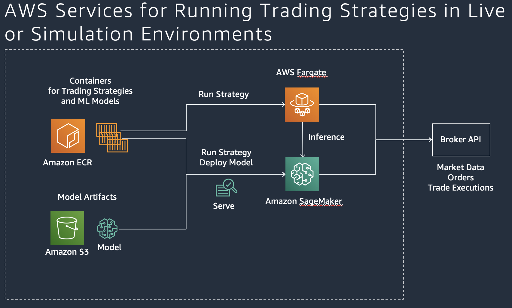

# Algorithmic Trading Workshop

As part of this workshop, participants will learn how to build, backtest, and host algorithmic trading strategies that use technical indicators and advanced machine learning models with Amazon SageMaker.

_Time Commitment Expectations: This workshop was created to be completed in approximately 1 hour._

## Considerations for Each Role
As the team lead on this lean team of one, you'll need to wear multiple hats.  Below are some things we'll cover from the perspective of each role:
* Developer - You'll modify python script to update the trading strategies.
* Data Scientist - You'll need to load the data into your machine learning development environment.  Once loaded, you'll understand the data, use a machine learning algorithm to train the model and do predictions.
* Trader - You will use different trading strategies based on data to maximize Profit & Loss while attributing to Risk.

## Goals

At minimum, at the end of this workshop, you should have backtested several trading strategies using Amazon SageMaker and also trained machine learning models that are used in the trading strategies. You also get a basic understand how trading strategies using trend following and machine learning are developed with Python and can be optimized for better performance.

## Solution Architecture

## Supported regions:
* us-east-1 (N. Virginia)
* us-east-2 (Ohio)
* us-west-2 (Oregon)
* ap-southeast-1 (Singapore)
* ap-northeast-1 (Tokyo)
* eu-central-1 (Frankfurt)
* eu-west-1 (Ireland)

## License

This library is licensed under the MIT-0 License. See the LICENSE file.

  
<b>External Dependencies</b>

This package depends on and may retrieve a number of third-party software packages (such as open source packages) from third-party servers at install-time or build-time ("External Dependencies"). The External Dependencies are subject to license terms that you must accept in order to use this package. If you do not accept all of the applicable license terms, you should not use this package. We recommend that you consult your company’s open source approval policy before proceeding.

Provided below is a list of the External Dependencies and the applicable license terms as indicated by the documentation associated with the External Dependencies as of Amazon's most recent review of such documentation.
THIS INFORMATION IS PROVIDED FOR CONVENIENCE ONLY. AMAZON DOES NOT PROMISE THAT THE LIST OR THE APPLICABLE TERMS AND CONDITIONS ARE COMPLETE, ACCURATE, OR UP-TO-DATE, AND AMAZON WILL HAVE NO LIABILITY FOR ANY INACCURACIES. YOU SHOULD CONSULT THE DOWNLOAD SITES FOR THE EXTERNAL DEPENDENCIES FOR THE MOST COMPLETE AND UP-TO-DATE LICENSING INFORMATION.
YOUR USE OF THE EXTERNAL DEPENDENCIES IS AT YOUR SOLE RISK. IN NO EVENT WILL AMAZON BE LIABLE FOR ANY DAMAGES, INCLUDING WITHOUT LIMITATION ANY DIRECT, INDIRECT, CONSEQUENTIAL, SPECIAL, INCIDENTAL, OR PUNITIVE DAMAGES (INCLUDING FOR ANY LOSS OF GOODWILL, BUSINESS INTERRUPTION, LOST PROFITS OR DATA, OR COMPUTER FAILURE OR MALFUNCTION) ARISING FROM OR RELATING TO THE EXTERNAL DEPENDENCIES, HOWEVER CAUSED AND REGARDLESS OF THE THEORY OF LIABILITY, EVEN IF AMAZON HAS BEEN ADVISED OF THE POSSIBILITY OF SUCH DAMAGES. THESE LIMITATIONS AND DISCLAIMERS APPLY EXCEPT TO THE EXTENT PROHIBITED BY APPLICABLE LAW.

** backtrader; version 1.9.74.123 -- https://www.backtrader.com/

## Dataset

We use the dataset generated by [Chi Zhang](https://github.com/vermouth1992/drl-portfolio-management/tree/master/src/utils/datasets). It contains the historic price of 16 target stocks from NASDAQ100, including open, close, high and low prices from 2012-08-13 to 2017-08-11. Specifically, those stocks are: “AAPL”, “ATVI”, “CMCSA”, “COST”, “CSX”, “DISH”, “EA”, “EBAY”, “FB”, “GOOGL”, “HAS”, “ILMN”, “INTC”, “MAR”, “REGN” and “SBUX”.

In this workshop, we'll backtest our trading strategies with the INTC stock.

  
<b>This dataset is licensed under a MIT License.</b>

Copyright (c) 2017 Chi Zhang

Permission is hereby granted, free of charge, to any person obtaining a copy of this software and associated documentation files (the "Software"), to deal in the Software without restriction, including without limitation the rights to use, copy, modify, merge, publish, distribute, sublicense, and/or sell copies of the Software, and to permit persons to whom the Software is furnished to do so, subject to the following conditions:

The above copyright notice and this permission notice shall be included in all copies or substantial portions of the Software.

THE SOFTWARE IS PROVIDED "AS IS", WITHOUT WARRANTY OF ANY KIND, EXPRESS OR IMPLIED, INCLUDING BUT NOT LIMITED TO THE WARRANTIES OF MERCHANTABILITY, FITNESS FOR A PARTICULAR PURPOSE AND NONINFRINGEMENT. IN NO EVENT SHALL THE AUTHORS OR COPYRIGHT HOLDERS BE LIABLE FOR ANY CLAIM, DAMAGES OR OTHER LIABILITY, WHETHER IN AN ACTION OF CONTRACT, TORT OR OTHERWISE, ARISING FROM, OUT OF OR IN CONNECTION WITH THE SOFTWARE OR THE USE OR OTHER DEALINGS IN THE SOFTWARE.

## Step 1: Set up the environment

**Time to complete:** 5-10 minutes.

We are going to use [AWS SageMaker](https://aws.amazon.com/sagemaker/) as our exploration and backtest environment. It will get you bootstrapped with a Jupyter Notebook that is able to run the notebooks for this workshop.

### Step 1.1: Create Git Repository for Notebook Instance

1. Navigate to Amazon SageMaker [in the console](https://console.aws.amazon.com/sagemaker) and Select Notebook / Notebook / Git Repositories and Click **Add repository**.
1. Select GitHub/Other Git-based repo.
1. Set 'Amazon SageMaker repository name' to **algotrading-workshop**, Set 'Git Repository URL' to https://github.com/aws-samples/algorithmic-trading
1. Select to use No Secret.
1. Click **Add repository**.

### Step 1.2: Create Notebook Instance

1. Prepare IAM role for SageMaker Notebook

  **Option 1.1:** If you run this in a provisioned AWS account as part of an AWS workshop, navigate to IAM [in the console](https://console.aws.amazon.com/iam) and Select Access Management / Roles. Search for **TeamRole** and click on it to get the Role ARN from the role screen. Please note down this ARN for the next step.

  **Lookup ARN for TeamRole**
  

  **Option 1.2:** If you run this in your own AWS account, create a **SageMakerExecutionRole** and attach the following permission to it: **AmazonEC2ContainerRegistryFullAccess**. Please note down the role for the next step.

1. Navigate to Amazon SageMaker [in the console](https://console.aws.amazon.com/sagemaker) and Select Notebook / Notebook instances and Click **Create notebook instance**.
1. Set 'Notebook instance name' to **algotrading**.
1. In the “Permissions and Encryption” section, choose either “Enter a custom IAM role ARN” and use the TeamRole ARN you have noted down earlier (e.g. **arn:aws:iam::{YourAccountID}:role/TeamRole**) or select the **SageMakerExecutionRole** you have noted down earlier.
1. Under Git Repositories, select the default repository from the dropdown list: **algotrading-workshop**.
1. Click **Create notebook instance**. This will take a few minutes. Wait until your Notebook instance has the Status "InService".

  **Notebook InService**
  

1. Click on the first link **Open Jupyter**. This will open the Jupyter notebook for this instance. Verify that you see the following folders that have been cloned from the git repository. You will run different Jupyter notebooks from these folders in the next steps.

  **Jupyter Folders**
  

## Step 2: Backtest a trend following strategy

**Time to complete:** 15 minutes.

In this module, we backtest a trend following strategy with Amazon SageMaker.

You can choose between the following trading strategies:
1. **Simple Moving Average Strategy**: **2_Strategies/Strategy SMA.ipynb**

1. **Daily Breakout Strategy**: **2_Strategies/Strategy_Breakout.ipynb**

Select the Jupyter Notebook for backtesting the strategy in the folder **2_Strategies** for your selected strategy and run it from your Amazon SageMaker Notebook instance. In the instructions, there is guidance on how to optimize the strategy.

## Step 3: Backtest a machine-learning based strategy

**Time to complete:** 20 minutes.

In this module, we backtest a machine-learning strategy with Amazon SageMaker.

Usually you will have two parts, one for training the machine learning model, and one for backtesting the strategy. You can run both notebooks or skip the training of the model as there is already a trained model available in the repository:

**ML Long/Short Prediction Strategy**
* Model Training: **3_Models/Train_Model_Forecast.ipynb**
* Strategy Backtesting: **2_Strategies/Strategy_Forecast.ipynb**

### Step 3.1 Train machine-learning model (optional)

Select the Jupyter Notebook for training the model in the folder **3_Models** and run it from your Amazon SageMaker Notebook instance. In the instructions, there is guidance on how to optimize the model.

### Step 3.2 Backtest machine-learning based strategy

Select the Jupyter Notebook for backtesting the strategy in the folder **2_Strategies** and run it from your Amazon SageMaker Notebook instance. In the instructions, there is guidance on how to optimize the strategy.

## Step 4: Run and host trading strategies

This is not part of the workshop but you can check out the following Notebook how this can be done with Amazon SageMaker: **2_Strategies / Host_Strategy_Live_Simulation.ipynb**

### Congratulations! You have completed the workshop. Don't forget to cleanup the resources if you use your own account in this workshop.

## Step 5: Cleanup (Optional)

  
Please expand for detailed instructions.

To avoid charges for resources you no longer need when you’re done with this workshop, you can delete them or, in the case of your notebook instance, stop them. Here are the resources you should consider:

### Step 5.1: Notebook instances

You have two options if you do not want to keep the notebook instance running. If you would like to save it for later, you can stop rather than deleting it.

1. To stop a notebook instance: click the Notebook instances link in the left pane of the SageMaker console home page. Next, click the Stop link under the ‘Actions’ column to the left of your notebook instance’s name. After the notebook instance is stopped, you can start it again by clicking the Start link. Keep in mind that if you stop rather than delete it, you will be charged for the storage associated with it.
1. To delete a notebook instance: first stop it per the instruction above. Next, click the radio button next to your notebook instance, then select Delete from the Actions drop down menu.

### Step 5.2: S3 Bucket

If you retain the S3 bucket used in this workshop, you will be charged for storage. To avoid these charges if you no longer wish to use the bucket, you may delete it. To delete the bucket, go to the S3 service console, and locate your bucket’s name in the bucket table. Next, click in the bucket table row for your bucket to highlight the table row. At the top of the table, the Delete Bucket button should now be enabled, so click it and then click the Confirm button in the resulting pop-up to complete the deletion.

### Step 5.3: Elastic Container Registry (ECR)

if you retain containers in ECR you created for this workshop, you could be charged for storage. To avoid these charges if you no longer wish to use these containers, you may delete it. To delete containers, go to the ECR service console.
