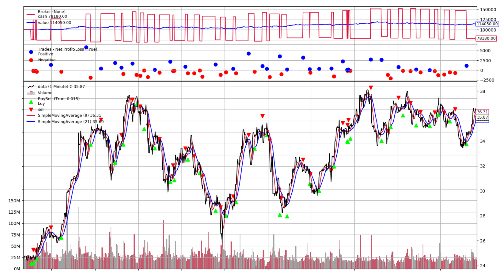

# Algorithmic Trading Workshop

In this workshop, participants will learn how to load and store financial data on AWS from AWS Data Exchange and other external data sources and how to build and backtest algorithmic trading strategies with Amazon SageMaker that use technical indicators and advanced machine learning models.

_Time Commitment Expectation: This workshop was created to be completed in approximately 1h 30 min._

## Regions

This workshop has been tested in **us-east-1**.

## Considerations for Each Role
As the team lead on this lean team of one, you'll need to wear multiple hats.  Below are some things we'll cover from the perspective of each role:
* Data Engineer - You'll modify scripts to load external market data to AWS.
* Data Scientist - You'll need to load the data into your machine learning development environment. Once loaded, you'll understand the data, use a machine learning algorithm to train the model and do predictions.
* Trader - You will use different trading strategies based on data to maximize Profit & Loss while attributing to Risk.

## Goals

At minimum, at the end of this workshop, you will have an understanding how to load historical price data from external market data sources like AWS Data Exchange into S3. You get familiar how to store price data in S3 and expose it via Glue Data Catalog and Athena, how to backtested trading strategies using Amazon SageMaker, and how to train machine learning models that are used in trading strategies. You also get a basic understand how trading strategies using trend following and machine learning are developed with Python and can be optimized for better performance.

## License

This library is licensed under the MIT-0 License. See the LICENSE file.

  
<b>External Dependencies</b>

This package depends on and may retrieve a number of third-party software packages (such as open source packages) from third-party servers at install-time or build-time ("External Dependencies"). The External Dependencies are subject to license terms that you must accept in order to use this package. If you do not accept all of the applicable license terms, you should not use this package. We recommend that you consult your company’s open source approval policy before proceeding.

Provided below is a list of the External Dependencies and the applicable license terms as indicated by the documentation associated with the External Dependencies as of Amazon's most recent review of such documentation.
THIS INFORMATION IS PROVIDED FOR CONVENIENCE ONLY. AMAZON DOES NOT PROMISE THAT THE LIST OR THE APPLICABLE TERMS AND CONDITIONS ARE COMPLETE, ACCURATE, OR UP-TO-DATE, AND AMAZON WILL HAVE NO LIABILITY FOR ANY INACCURACIES. YOU SHOULD CONSULT THE DOWNLOAD SITES FOR THE EXTERNAL DEPENDENCIES FOR THE MOST COMPLETE AND UP-TO-DATE LICENSING INFORMATION.
YOUR USE OF THE EXTERNAL DEPENDENCIES IS AT YOUR SOLE RISK. IN NO EVENT WILL AMAZON BE LIABLE FOR ANY DAMAGES, INCLUDING WITHOUT LIMITATION ANY DIRECT, INDIRECT, CONSEQUENTIAL, SPECIAL, INCIDENTAL, OR PUNITIVE DAMAGES (INCLUDING FOR ANY LOSS OF GOODWILL, BUSINESS INTERRUPTION, LOST PROFITS OR DATA, OR COMPUTER FAILURE OR MALFUNCTION) ARISING FROM OR RELATING TO THE EXTERNAL DEPENDENCIES, HOWEVER CAUSED AND REGARDLESS OF THE THEORY OF LIABILITY, EVEN IF AMAZON HAS BEEN ADVISED OF THE POSSIBILITY OF SUCH DAMAGES. THESE LIMITATIONS AND DISCLAIMERS APPLY EXCEPT TO THE EXTENT PROHIBITED BY APPLICABLE LAW.

** backtrader; version 1.9.74.123 -- https://www.backtrader.com/

## Step 0: Set up the environment

We deploy the base components via CloudFormation script:
[Launch](https://console.aws.amazon.com/cloudformation/home?region=us-east-1#/stacks/new?stackName=algo&templateURL=https://github.com/aws-samples/algorithmic-trading/raw/master/0_Setup/ReferenceArchitecture-CF.json)

This will take ca. 5 minutes.

## Step 1: Load Historical Market Data

We have two different data source options for this workshop. Pick one of these options. Intraday data is larger and will take more time to download (ca. 15 mins).
1. Daily EOD Stock Price Data from AWS Data Exchange
1. Intraday Stock Price Data from Deutsche Börse Public Dataset

### Data Option 1: Daily EOD Stock Price Data (from AWS Data Exchange)

For this workshop we want to download the following [dataset](https://aws.amazon.com/marketplace/pp/prodview-e2aizdzkos266#overview). 

To download this dataset via AWS Data Exchange, complete a subscription request, provide the required information for Company Name, Name, Email Address, and Intended Use Case and send the subscription request to the provider. Once the provider confirms the subscription, you can navigate to [AWS Data Exchange/My subscriptions/Entitled data](https://us-east-1.console.aws.amazon.com/dataexchange/home?region=us-east-1#/entitled-data).

Then choose the latest revision for this subscription, select all assets, and click on **Export to Amazon S3**. In the new window select the root folder of the S3 bucket that starts with "*algo-data-*". Then click on **Export** and wait until your export job is completed.

In order to use this dataset for algorithmic trading, we want to standardize it to CSV files with the following columns: **dt, sym, open, high, low, close, vol**.

If you have successfully exported the dataset, please run the the following Jupyter notebook to format the data and store it in the ***hist_data_daily*** folder of your S3 bucket. Go to [Amazon SageMaker/Notebook/Notebook instances](https://us-east-1.console.aws.amazon.com/sagemaker/home?region=us-east-1#/notebook-instances), then click on ***Open Jupyter*** for the provisioned notebook instance. Run all the cells in **1_Data/Load_Hist_Data_Daily.ipynb**.

If you are not able to exported the dataset, you can run instead the following Jupyter notebook that loads EOD price data from another public source. Run all the cells in **1_Data/Load_Hist_Data_Daily_Public.ipynb**.

### Data Option 2: Intraday Stock Price Data (from Deutsche Börse Public Dataset) 

For this dataset, please run the the following Jupyter notebook to download the data from the public S3 bucket and format the data and store it in the ***hist_data_intrday*** folder of your S3 bucket. Go to [Amazon SageMaker/Notebook/Notebook instances](https://us-east-1.console.aws.amazon.com/sagemaker/home?region=us-east-1#/notebook-instances), then click on ***Open Jupyter*** for the provisioned notebook instance. Run all the cells in **1_Data/Load_Hist_Data_Intraday.ipynb**.

Please note that this will take ca. 15 min.

## Step 2: Backtest a trend following strategy (or backtest directly ML-based strategies in Step 3)

In this module, we backtest a trend following strategy with Amazon SageMaker.

You can choose between the following trading strategies:
1. **Simple Moving Average Strategy**: **2_Strategies/Strategy SMA.ipynb**

1. **Daily Breakout Strategy**: **2_Strategies/Strategy_Breakout.ipynb**

Select the Jupyter Notebook for backtesting the strategy in the folder **2_Strategies** for your selected strategy and run it from your Amazon SageMaker Notebook instance. In the instructions, there is guidance on how to optimize the strategy.

## Step 3: Backtest a machine-learning based strategy

In this module, we backtest a machine-learning strategy with Amazon SageMaker.

Usually you will have two parts, one for training the machine learning model, and one for backtesting the strategy. You can run both notebooks or skip the training of the model as there is already a trained model available in the repository:

**ML Long/Short Prediction Strategy**
* Model Training: **3_Models/Train_Model_Forecast.ipynb**
* Strategy Backtesting: **2_Strategies/Strategy_Forecast.ipynb**

### Step 3.1 Train machine-learning model (you can skip this as a trained model is already provided)

Select the Jupyter Notebook for training the model in the folder **3_Models** and run it from your Amazon SageMaker Notebook instance. In the instructions, there is guidance on how to optimize the model.

### Step 3.2 Backtest machine-learning based strategy

Select the Jupyter Notebook for backtesting the strategy in the folder **2_Strategies** and run it from your Amazon SageMaker Notebook instance. In the instructions, there is guidance on how to optimize the strategy.

### Congratulations! You have completed the workshop. Don't forget to cleanup the resources if you use your own account in this workshop.